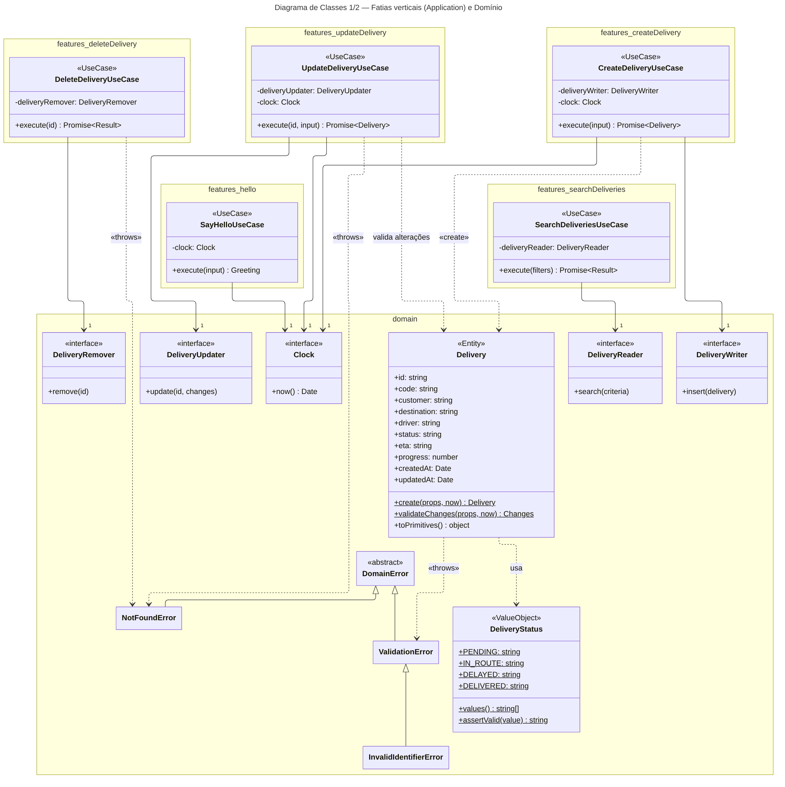
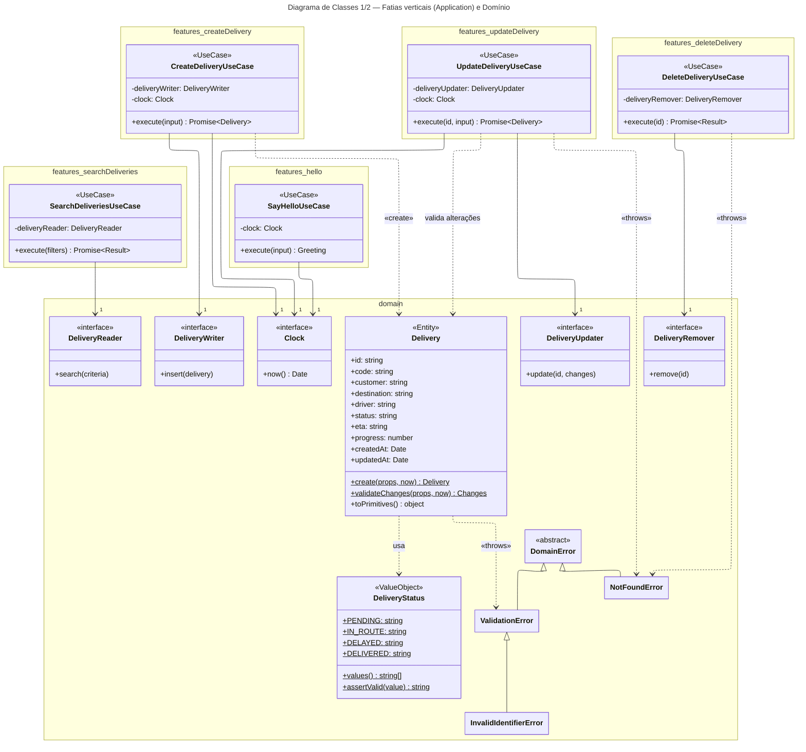
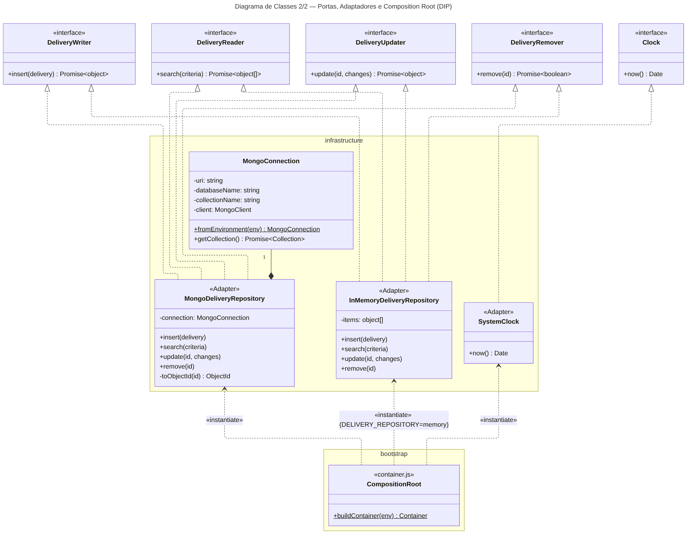
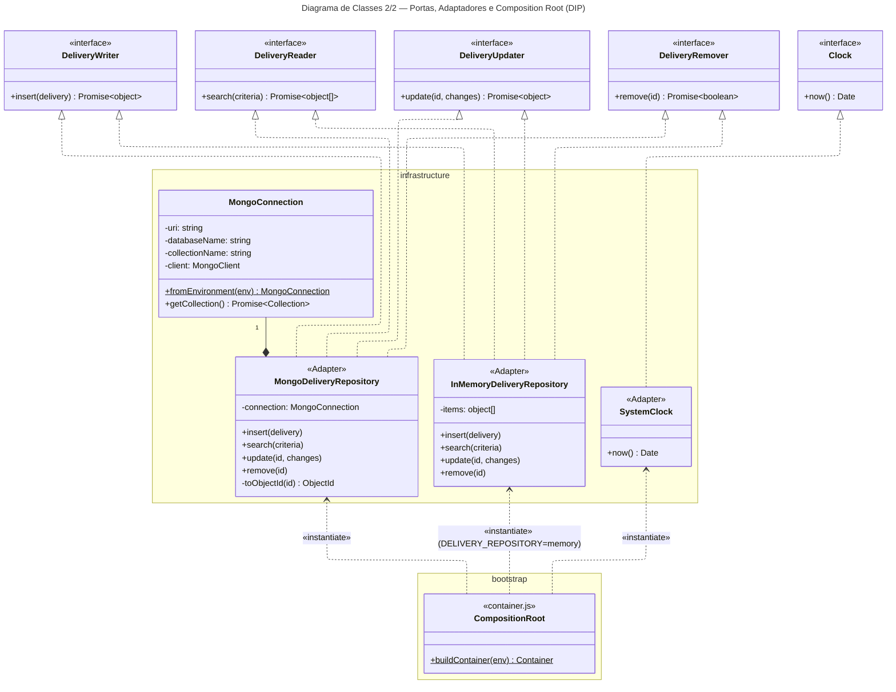
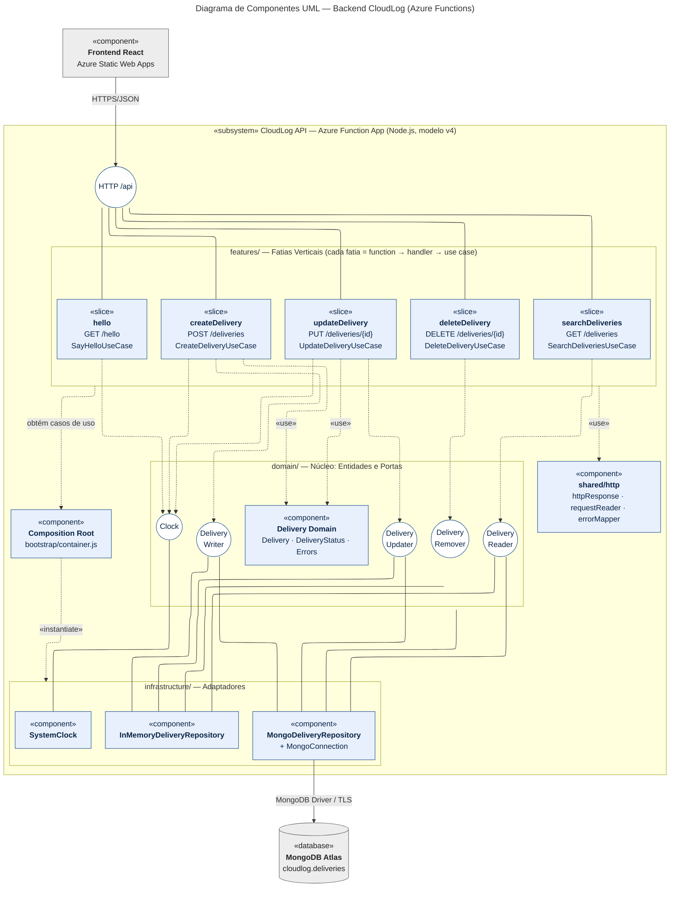
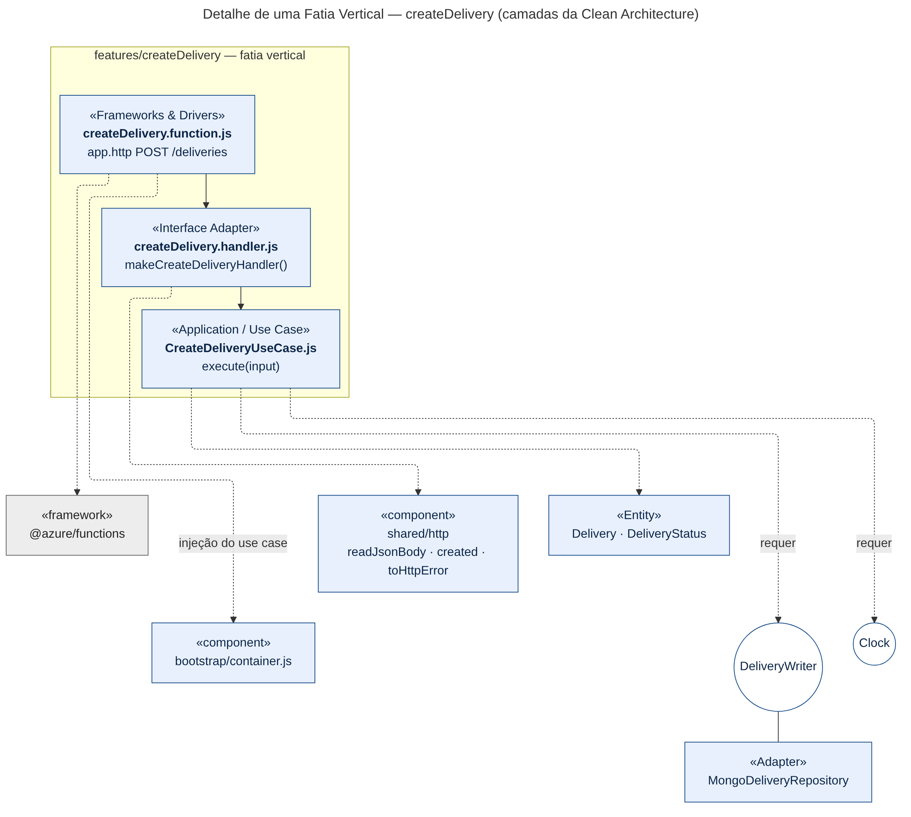
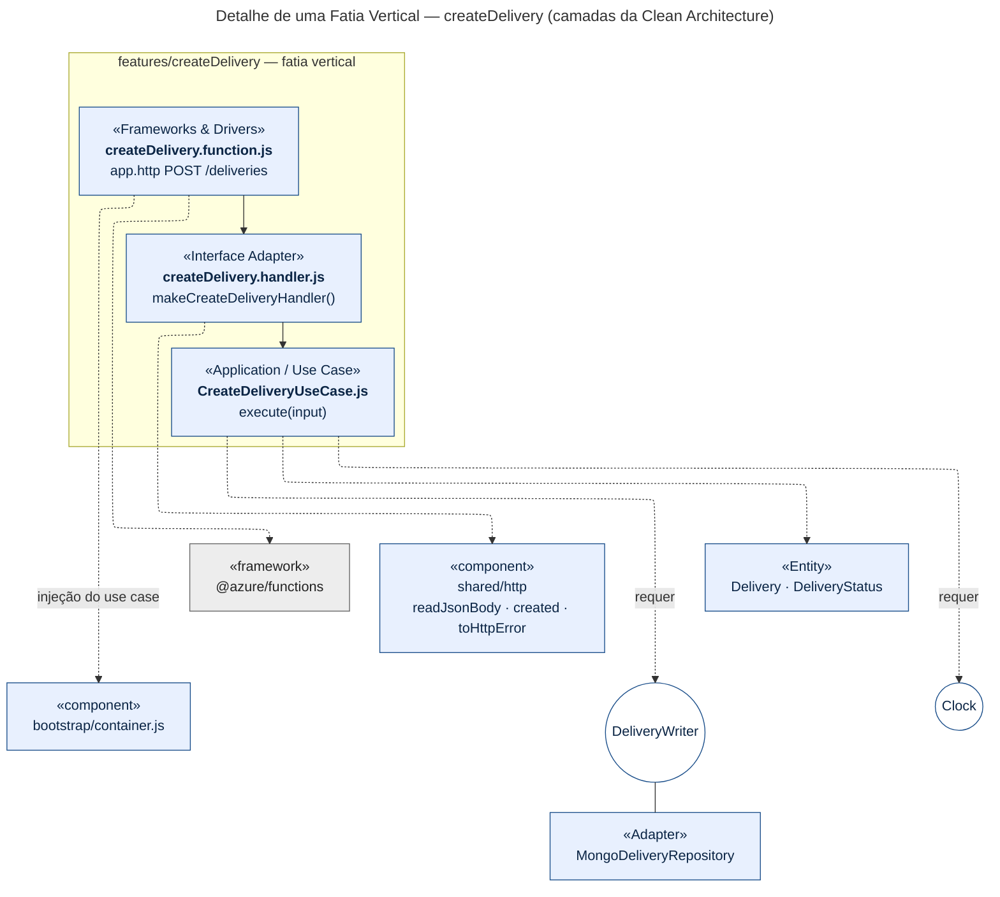

# CloudLog — Arquitetura do Backend (Vertical Slice + Clean Architecture + SOLID)

**Integrantes:** Camilla Augusta Uber · João Davi · Laura Guillarducci
**Branch:** `refactor/vertical-slice-clean-architecture`
**Escopo:** `api/` — Azure Functions (Node.js, modelo v4) + MongoDB Atlas

## 1. Visão geral

O backend foi reorganizado em **fatias verticais** (uma pasta por funcionalidade), e cada fatia segue as camadas da **Clean Architecture**. O contrato HTTP consumido pelo frontend não mudou (mesmas rotas, status e formato de JSON).

```
api/src/
├── index.js                     # registra as fatias
├── bootstrap/container.js       # Composition Root (injeção de dependência)
├── domain/                      # Entidades, Value Objects, erros e portas (núcleo)
│   ├── delivery/Delivery.js
│   ├── delivery/DeliveryStatus.js
│   ├── errors.js
│   └── ports/deliveryPorts.js
├── features/                    # FATIAS VERTICAIS
│   ├── createDelivery/   (CreateDeliveryUseCase · createDelivery.handler · createDelivery.function)
│   ├── searchDeliveries/ (SearchDeliveriesUseCase · searchDeliveries.handler · searchDeliveries.function)
│   ├── updateDelivery/   (UpdateDeliveryUseCase · updateDelivery.handler · updateDelivery.function)
│   ├── deleteDelivery/   (DeleteDeliveryUseCase · deleteDelivery.handler · deleteDelivery.function)
│   └── hello/            (SayHelloUseCase · hello.handler · hello.function)
├── infrastructure/              # Adaptadores de saída
│   ├── persistence/mongo/       (MongoConnection · MongoDeliveryRepository)
│   ├── persistence/memory/      (InMemoryDeliveryRepository)
│   └── time/SystemClock.js
└── shared/http/                 # httpResponse · requestReader · errorMapper
```

| Camada (Clean Architecture) | Onde está | Pode depender de |
|---|---|---|
| Entities | `domain/` | nada (puro) |
| Use Cases | `features/*/*UseCase.js` | `domain/` |
| Interface Adapters | `features/*/*.handler.js`, `shared/http/`, `infrastructure/` | `domain/` (+ use cases via injeção) |
| Frameworks & Drivers | `features/*/*.function.js`, `bootstrap/`, `@azure/functions`, `mongodb` | tudo (borda) |

## 2. Princípios SOLID aplicados

| Princípio | Como aparece no código |
|---|---|
| **S** — Responsabilidade Única | Regras de validação na entidade `Delivery`; orquestração no use case; tradução HTTP no handler; persistência no repositório; registro da rota no `.function.js`. |
| **O** — Aberto/Fechado | Nova funcionalidade = nova pasta em `features/`, sem alterar as existentes. Novos erros entram como uma linha em `errorStatusTable` (`errorMapper.js`). |
| **L** — Substituição de Liskov | `MongoDeliveryRepository` e `InMemoryDeliveryRepository` cumprem as mesmas portas e são intercambiáveis (testes e `DELIVERY_REPOSITORY=memory`). `assertPort` valida o contrato. |
| **I** — Segregação de Interface | Portas pequenas: `DeliveryWriter`, `DeliveryReader`, `DeliveryUpdater`, `DeliveryRemover`, `Clock`. Cada use case recebe apenas a que usa. |
| **D** — Inversão de Dependência | Use cases dependem de abstrações (portas); só o `bootstrap/container.js` conhece as classes concretas e faz a injeção. |

## 3. Diagrama de Classes

### 3.1 Fatias verticais e domínio





### 3.2 Portas, adaptadores e Composition Root





## 4. Diagrama de Componentes

### 4.1 Visão do backend

Legenda: seta tracejada = dependência/interface requerida; linha sólida ligada ao círculo = interface fornecida (realização da porta).




### 4.2 Detalhe de uma fatia vertical





## 5. Testes

```bash
cd api
npm install
npm test            # todos (unitários + arquitetura)
npm run test:unit   # domínio, casos de uso, handlers e repositório
npm run test:arch   # regras de dependência (estilo ArchUnit)
```

Os testes de arquitetura (`api/tests/architecture/architecture.test.js`) garantem que: o domínio não depende de nada externo; use cases só dependem do domínio; fatias não se importam entre si; `mongodb` fica restrito ao adaptador Mongo; `@azure/functions` fica restrito aos `*.function.js`; só o Composition Root instancia a infraestrutura; e toda fatia possui UseCase, handler e function.
